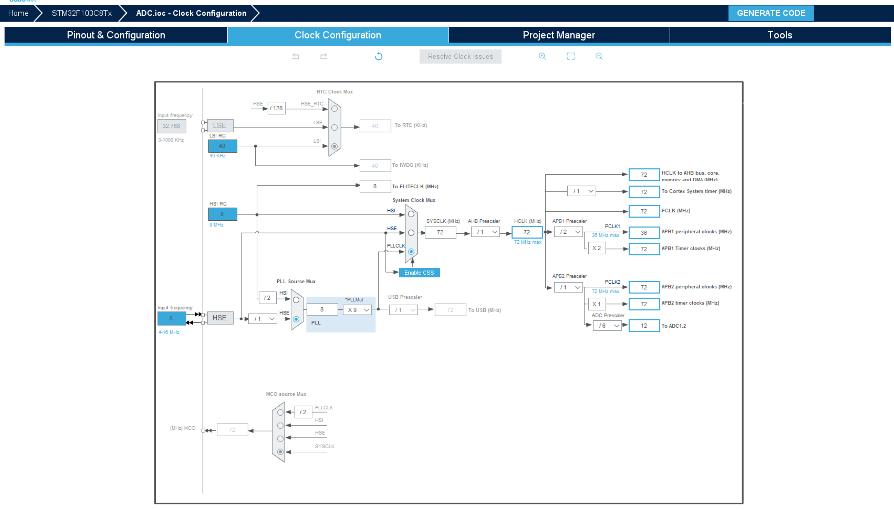

<!--
 * @Author: szf
 * @Date: 2023-01-03 23:05:53
 * @LastEditTime: 2023-01-03 23:51:41
 * @LastEditors: szf
 * @Description: 
 * @FilePath: \STM32-Notes\cubemx.md
 * @WeChat:szf13373959031
-->
# 基础配置
- 时钟 
  > 外部晶振，可以都选外部晶振Crystal/Ceramic Resonator。
- debug
  > SW模式就选择serial Wire。JTAG模式就选择JTAG。stlink调试就是SW模式，jlink调试就是JTAG模式
- 时钟树
- Project
  ```latex
  Toolchain/IDE 我用VS Code就选makefile
  ```
- Code Generator
    ```latex
    1. copy all used libraries into the project folder：复制所有库文件（不管工程需要用到还是没用到）到生成的工程目录中，此做法可以使在不使用Cubemx或者电脑没有安装cubemx,依然可以按照标准库的编程习惯调用HAL库函数进行程序编写。

    2. Copy only the necessary library files： 只复制必要的库文件。这个相比上一个减少了很多文件。比如你没有使用CAN、SPI…等外设，就不会拷贝相关库文件到你工程下。

    3. Add necessary library files as reference in the toolchain project configuration file ：在工具链项目配置文件中添加必要的库文件作为参考。这里没有复制HAL库文件，只添加了必要文件（如main.c）。相比上面，没有Drivers相关文件。

    4. Generate peripheral initialization as a pair of’.c/.h’ files per peripheral：每个外设生成独立的.C .H文件，方便独立管理。不勾：所有初始化代码都生成在main.c 勾选：初始化代码生成在对应的外设文件。 如UART初始化代码生成在uart.c中。

    5. Backup previously generated files when re-generating：在重新生成时备份以前生成的文件。重新生成代码时，会在相关目录中生成一个Backup文件夹，将之前源文件拷贝到其中。

    6. keep user code when re-generating：重新生成代码时，保留用户代码(前提是代码写在规定的位置。也就是生成工程文件中的BEGIN和END之间。否则同样会删除。后面会根据生成的工程进行说明)

    7. delete previously generated files when not re-generated：删除以前生成但现在没有选择生成的文件 比如：之前生成了led.c，现在重新配置没有led.c，则会删除之前的led.c文件。(此功能根据自身要求进行取舍)
    ```

# GPIO
