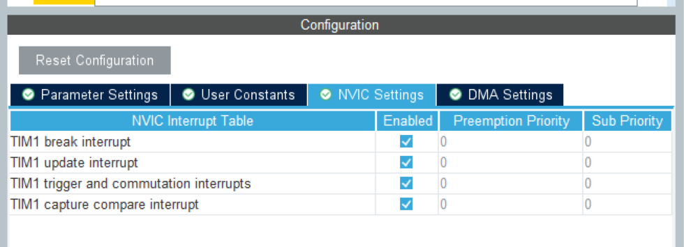

<!--
 * @Author: szf
 * @Date: 2023-01-03 23:05:53
 * @LastEditTime: 2023-01-07 16:46:41
 * @LastEditors: szf
 * @Description: 
 * @FilePath: \STM32-Notes\Note\cubemx.md
 * @WeChat:szf13373959031
-->
# 软件使用
- 帮助
  ```latex
  1. Docs&Resouses 手册
  2. Check for Updates 更新
  ```
# 基础配置
- 时钟 
  ```latex
  外部晶振，可以都选外部晶振Crystal/Ceramic Resonator。
  ```
- debug
  ```latex
  1. SW模式就选择serial Wire。JTAG模式就选择JTAG。stlink调试就是SW模式，jlink调试就是JTAG模式
  2. Timebase Source选择的是SysTick，因为这里不使用RTOS，使用RTOS的话这里最好选择一个Timer，这个后面再做详细介绍
  ```
- 中断
  ```latex
  1. Priority Group 设置优先级分组
  2. Preemption Priority 抢占优先级
  3. Sub Priority 副优先级
  ```
- 时钟树
- Project
  ```latex
  Toolchain/IDE 我用VS Code就选makefile
  ```
- Code Generator
    ```latex
    1. copy all used libraries into the project folder：复制所有库文件（不管工程需要用到还是没用到）到生成的工程目录中，此做法可以使在不使用Cubemx或者电脑没有安装cubemx,依然可以按照标准库的编程习惯调用HAL库函数进行程序编写。

    2. Copy only the necessary library files： 只复制必要的库文件。这个相比上一个减少了很多文件。比如你没有使用CAN、SPI…等外设，就不会拷贝相关库文件到你工程下。

    3. Add necessary library files as reference in the toolchain project configuration file ：在工具链项目配置文件中添加必要的库文件作为参考。这里没有复制HAL库文件，只添加了必要文件（如main.c）。相比上面，没有Drivers相关文件。

    4. Generate peripheral initialization as a pair of’.c/.h’ files per peripheral：每个外设生成独立的.C .H文件，方便独立管理。不勾：所有初始化代码都生成在main.c 勾选：初始化代码生成在对应的外设文件。 如UART初始化代码生成在uart.c中。

    5. Backup previously generated files when re-generating：在重新生成时备份以前生成的文件。重新生成代码时，会在相关目录中生成一个Backup文件夹，将之前源文件拷贝到其中。

    6. keep user code when re-generating：重新生成代码时，保留用户代码(前提是代码写在规定的位置。也就是生成工程文件中的BEGIN和END之间。否则同样会删除。后面会根据生成的工程进行说明)

    7. delete previously generated files when not re-generated：删除以前生成但现在没有选择生成的文件 比如：之前生成了led.c，现在重新配置没有led.c，则会删除之前的led.c文件。(此功能根据自身要求进行取舍)
    ```

# GPIO
- GPIO配置
  ```latex
  1. GPIO output level : 默认输出电平
  
  2. GPIO mode GPIO : 输出模式

  3. GPIO Pull-up/Pull-down : 上拉、下拉配置

  4. 最大输出速度

  5. 自定义别名
  ```

# EXTI
- 引脚
- 模式
  ```latex
  1. 上升沿触发的外部中断：数字电平从低电平（数字“0”）变为高电平（数字“1”）的那一瞬间叫作上升沿。上升沿触发是当信号有上升沿时的开关动作，当电位由低变高而触发输出变化的就叫上升沿触发。也就是当测到的信号电位是从低到高也就是上升时就触发，叫做上升沿触发。
  
  2. 下降沿触发的外部中断：数字电路中，数字电平从高电平（数字“1”）变为低电平（数字“0”）的那一瞬间叫作下降沿。下降沿触发是当信号有下降沿时的开关动作，当电位由高变低而触发输出变化的就叫下降沿触发。也就是当测到的信号电位是从高到低也就是下降时就触发，叫做下降沿触发。
  
  3. 上升/下降沿触发的外部中断
  
  4. 上升沿触发的事件中断
  
  5. 下降沿触发的事件中断
  
  6. 上升/下降沿触发的事件中断
  ```
- 中断

# TIM
- 选择定时器和通道
- 定时器配置
  ```latex
  1. Slave Mode和Trigger Source都是用于设置定时器主从配置的选项，暂时用不到
  2. Clock Source：定时器时钟源，选择Internal Clock
  3. Combined Channals : 自带的编码器模式
  ```
- 通道配置
  ```latex
  ```
- 参数设置
  ```latex
  ```
- 中断与DMA
  ```latex
  ```

# USART
- 选择引脚
  ```latex
  ```
- 配置模式
  ```latex
  1. 异步模式 单工模式 多处理通讯 红外解码通信 总线通信 智能卡模式
  ```
- 参数配置
  ```latex
  波特率 数据位 校验位 停止位
  ```
- 中断与DMA
  ```latex
  ```

# IIC
- 模式配置
- 参数配置
  ```latex
  1. Master  features  主模式特性
  2. I2C Speed Mode： IIC模式设置 快速模式和标准模式。实际上也就是速率的选择。
  3. I2C Clock Speed：I2C传输速率，默认为100KHz
  4. Slave  features  从模式特性
  5. Clock No Stretch Mode： 时钟没有扩展模式
    (IIC时钟拉伸(Clock stretching)
    clock stretching通过将SCL线拉低来暂停一个传输.直到释放SCL线为高电平,传输才继续进行.clock stretching是可选的,实际上大多数从设备不包括SCL驱动,所以它们不能stretch时钟.)
  6. Primary Address Length selection： 从设备地址长度 设置从设备的地址是7bit还是10bit 大部分为7bit
  7. Dual Address Acknowledged： 双地址确认
  8. Primary slave address：  从设备初始地址
  ```
- 中断与DMA

# SPI
- 
  ```latex
  ```

# CAN
- 
- 

# FREERTOS
- Timebase Source
- 版本
- 